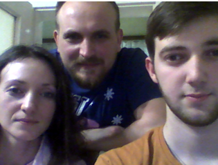
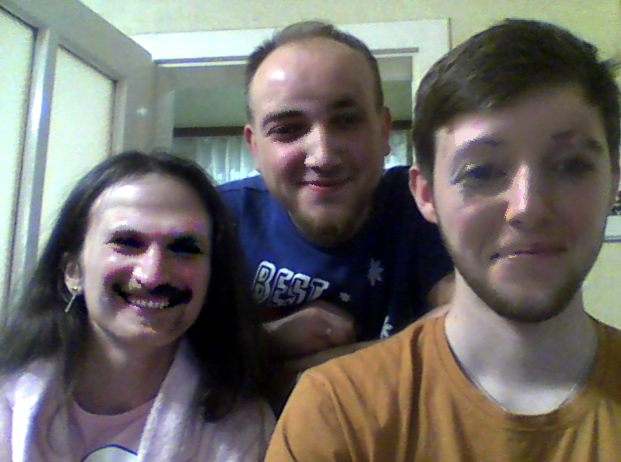
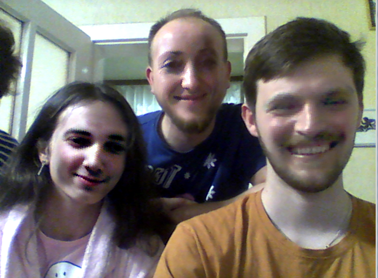

# FaceSwap-webcam

'FaceSwap-webcam' is 'randomly' swapping all the faces from the webcam. To see it working you have to run 'FaceRecognition.exe'

# Used libraries:

 - OpenCV
 - dlib

# Some results

 - Input:
	
 
 - Output:
	
	
	
	